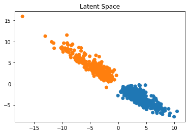

# Statistical-autoencoder

This is an implementation of : An efficient diagnostic that uses the latent space of a Non-Parametric Supervised Autoencoder for metabolomic datasets of clinical studies. In this repository, you will find the code to perform the statistical study described in the paper. For the clinical part only, you can find it here : https://github.com/Gustoaxel/Clinical-autoencoder
  
When using this code , please cite Barlaud, M., Guyard, F.: Learning sparse deep neural networks 
using efficient structured projections on convex constraints for green ai. ICPR 2020 Milan Italy (2020)

and 

Axel Gustovic, Celine Ocelli, Thierry Pourcher and Michel Barlaud : An efficient diagnostic that uses the latent space of a Non-Parametric Supervised Autoencoder for metabolomic datasets of clinical studies


## Table of Contents
***
1. [Installation](#installation)
2. [How to use](#use)
3. [Results Script_autoencoder_4folds](#resultstat)
4. [Results Script_diagnostics](#resultdiag)
  
    
## Installation : 
***

First, you will need a python runtime environment. If you don't have one on your computer we recommend you to download anaconda (https://www.anaconda.com/products/individual#Downloads). It is a platform that brings together several IDEs for machine learning. In the rest of this tutorial we will use Spyder. 
You can now download the code in zip format and unzip it on your computer.
Then, to execute our script, we will need several dependencies. To install them you will have to run this command in the spyder console (at the bottom right).
```
$ conda install -c anaconda pip
$ pip install -r requirements.txt 
```


(Warning, before launching this command you must go to the directory where the requirements.txt is located by using "cd" command in the console)

To install pytorch make sure you have a c++ compiler. If this is not the case, please follow the instructions in this link: https://docs.microsoft.com/en-us/cpp/build/vscpp-step-0-installation?view=msvc-160 for windows or install Xcode app if you use mac os

## How to use : 

Everything is ready, now you have to open the code in spyder (top left button). In our case the files are named : "script_diagnostic.py" and "Script_autoencoder_4folds.py"

Then run it with the Run files button. It is possible to change the parameters and the database studied directly in the code. 


Note that we have provided in this directory only the LUNG and Brain databases. To obtain the Covid database please contact Barlaud Michel (barlaud@i3s.unice.fr) or Pourcher Thierry (thierry.pourcher@univ-cotedazur.fr)

To use your own data it is important that it is in the same format as the provided databases. If this is the case then you just have to put the .csv file in the datas directory and then modify the file_name variable = "something.csv" in the code. 

Here is a list of modifiable parameters with our values for "Script_autoencoder_4folds.py": 

| Parameters | Name | Line in code | Recommended Value | Utility |
|:--------------:|:-------------:|:--------------:|:--------------:|:--------------:|
| ETA | ETA | 81 | 75 | Influences the number of features to use |
| Seed | Seed | 80 | [4, 5, 6] | Initialize the neural network parameters |
| Database | file_name | 106 | Lung | Name of the data file |
| Projection | TYPE_PROJ | 145 | l11 | Regulates the latent space for representation |
| Metabolomic selection | DoTopGenes | 156 | True | Knowing the features most used by the neural network |
| Scaling | doScale | 163 | True | data pre-processing |

Here is a list of modifiable parameters with our values for "script_diagnostic.py": 

| Parameters | Name | Line in code | Recommended Value | Utility |
|:--------------:|:-------------:|:--------------:|:--------------:|:--------------:|
| ETA | ETA | 85 | 600 | Influences the number of features to use |
| Seed | Seed | 84 | [5] | Initialize the neural network parameters |
| Database | file_name | 111 | Lung | Name of the data file |
| Projection | TYPE_PROJ | 150 | l11 | Regulates the latent space for representation |
| Metabolomic selection | DoTopGenes | 161 | False | Knowing the features most used by the neural network |
| Scaling | doScale | 167 | True | data pre-processing |


## Results Script_autoencoder_4folds : 
***
At the end of the script we have results in 3 forms: files save graphics and text data in the console.     

Explanation of the graphs :    

   
Set of patients represented in a 2 dimensional space 

   
Here we represent the probability distribution at the output of the classifier. It gives us a good indication of the certainty we have on the diagnosis

   
Weight associated to features by the neural network (gives an indication of the number of features used)

Explanation of the console :      

In the console it is possible to read the accuracy for each conducted experiment as well as several metrics related to this experiment


Explanation of the results saved : 
The program will save several files in the result_stat folder and then the name of your database    

The "Labelspred_softmax.csv" file gives the prediction and the confidence score for each patient   
The "proj_l11ball_acctest.csv" file gives the accuracy obtained by the network     
The "proj_l11ball_topGenes_Mean_Captum_dl_300.csv" file groups all the features with the weight that the network has assigned to them    


## Results Script_diagnostics : 
***

At the end of the script we have results in 3 forms: files save graphics and text data in the console : 

Explanation of the graphs :    

   
Set of patients represented in a 2 dimensional space. Moreover, it puts forward 2 patients for which we wish to have the diagnosis to know their position in the latent space 


Explanation of the console :    

In the console it is possible to read the confidence score of our diagnisis for each patients


Explanation of the results saved :     
The program will save several files in the result_diag folder and then the name of your database    

The "Labelspred_softmax.csv" file gives the prediction and the confidence score for each patient   
 

